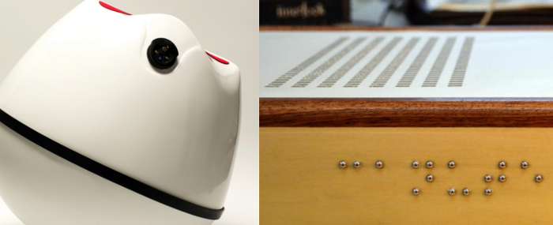
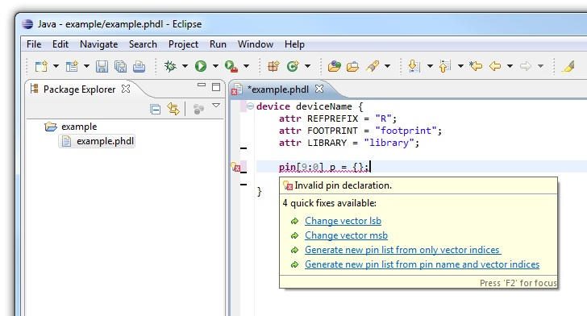
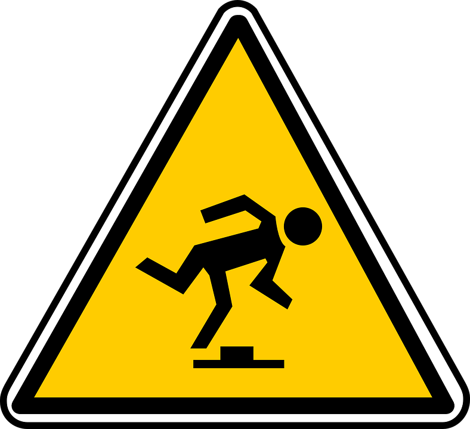

<video style="width:200%;left:0px;top:0px;position:absolute;" controls=false autoplay=true loop=true src=generative_circuit.mp4 />
<h1 class=box_textshadow style="left:200px;top:100px;position:absolute;color:white" >Designing PCBs with code</h1>
<h2 class=box_textshadow style="left:470px;top:200px;position:absolute;color:white" >by Kaspar Emanuel</h2>
<h6 class=box_textshadow style="left:750px;top:550px;position:absolute;color:white" >animation: <a style=color:inherit; href=https://twitter.com/ExUtumno>@ExUtumno</a></h6>

???


---

About Me

- Freelance electronic engineer and software developer
- Love writing code and love open source (especially electronics)
- [github.com/kasbah](https://github.com/kasbah)



???

- These are some projects that I work on, ones a chair controller for virtual reality another is a braille e-book reader

---


???

- You will notice I like to code and that I like hardware
- But I didn't say I like designing hardware all the much
- I get very frustrated with designing electronic circuits
- This is how it is typically done
- Generally you have a schematic entry tool
- And PCB layout tool
- You draw out a schematic, which is a sort of map where you want all your connections to go.
- And then place them onto a model of a board and route the connections your previously defined

---


???

- If you are designing digital hardware, something to be run on an FPGA
- You can actually use schematic entry as well
- But hardware description languages were invented in the 80s
- And largely that's how we digital design circuits now

---
<div style=display:flex;justify-content:center>

</div>

???

- Because schematic entry for this sort of task becomes way too confusing
---

```vhdl

-- (this is a VHDL comment)

-- import std_logic from the IEEE library
library IEEE;
use IEEE.std_logic_1164.all;

-- this is the entity
entity ANDGATE is
  port (
    I1 : in std_logic;
    I2 : in std_logic;
    O  : out std_logic);
end entity ANDGATE;

-- this is the architecture
architecture RTL of ANDGATE is
begin
  O <= I1 and I2;
end architecture RTL;
```

???
- So we use code to describe logic circuits because it's much easier to manage that complexity
- These are known as "hardware description languages" or HDLs
- These are for digital logic circuits

---


???
- So schematic entry for PCB designs can get quite confusing as well
- Especially if we have high pin count components like FPGAs actually
- These days schematics use a lot of labels, so generally your wires jump all over the place
- And creating these kinds of schematics in a graphical way can be very tedious as well


---

### Can we use HDLs for analog circuits?

```verilog
//Verilog-A (1993) and Verilog-AMS (2000)
`include "constants.vams"
`include "disciplines.vams"
// Simple ADC model
module adc_simple(clk, dout, vref, vin);
	// Parameters
	parameter integer bits = 4 from[1:24]; // Number of bits
	parameter integer td = 1 from[0:inf);  // Processing delay of the ADC
	// Define input/output
	input clk, vin, vref;
	output [bits-1:0] dout;
    electrical vref, vin;
	logic clk;
	reg [bits-1:0] dout;
	// Internal variables
	real ref, sample;
	integer i;
  ...
```
???

- People have tried to extend HDLs for analog and mixed signal design
- Verilog-A was defined in 1993 and it was merged into Verilog-AMS in 2000

---

```vhdl
-- VHDL-AMS
-- IEEE 1076.1-1999

library IEEE;
use IEEE.math_real.all;
use IEEE.electrical_systems.all;

entity DIODE is
   generic (iss : current := 1.0e-14;  -- Saturation current
            af  : real    := 1.0;      -- Flicker noise coefficient
            kf  : real    := 0.0);     -- Flicker noise exponent
   port (terminal anode, cathode : electrical);
end entity DIODE;

architecture IDEAL of DIODE is
  quantity v across i through anode to cathode;
  constant vt : voltage := 0.0258;     -- Thermal voltage at 300 K
begin

  i == iss * (exp(v/vt) - 1.0);

end architecture IDEAL;
```

- Also: "Circuit Description Language" (Taku Noda, IPST 1999)

???

- There is also an Analog and mixed signal extension for VHDL
- Another one I came across in a paper from 1999
- and I couldn't find any implementation
- The focus of these seems on simulation and verification
- Rather than just pure schematic entry
- So that means you have to know a lot about the behaviour of your circuits
- What we want is something to help us create netlists just as we do from schematics

---

#SPICE

```spice
AMP2.CIR – CASCADED OPAMPS
*
VS	1	0	AC	1	SIN(0 1 10KHZ)
*
R1	1	2	5K
R2	2	3	10K
XOP1	0 2	3	OPAMP1
R3	4	0	10K
R4	4	5	10K
XOP2	3 4	5	OPAMP1
*
* SINGLE-POLE OPERATIONAL AMPLIFIER MACRO-MODEL
* connections:      non-inverting input
*                   |   inverting input
*                   |   |   output
*                   |   |   |
.SUBCKT OPAMP1      1   2   6
* INPUT IMPEDANCE
RIN     1          2          10MEG
* DC GAIN (100K) AND POLE 1 (100HZ)
EP1	3 0	1 2	100K
RP1	3	4	1K
CP1	4	0	1.5915UF
* OUTPUT BUFFER AND RESISTANCE
EOUT	5 0	4 0	1
ROUT	5	6	10
.ENDS
*
* ANALYSIS
.TRAN	0.01MS  0.2MS
* VIEW RESULTS
.PLOT TRAN V(1) V(5)
.END
```

---

## What do people want when they want to make hardware more like software?

1. Fast build/test iteration cycles

2. Use programming constructs and tools for a faster/better design process

3. Modularity and re-usability


---


```cpp
/* PHDL - PCB hardware description language (Brent Nelson, 2011)*/


// A surface mount resistor
device resistor {
  attr REFPREFIX = "R";
  attr FOOTPRINT = "R0805";
  attr LIBRARY = "rcl-smd";
  attr VALUE = "1k";
  pin a = {1};
  pin b = {2};
}

design top {
  net vcc, vout, gnd;

  inst r1 of resistor {
    a = vcc;
    b = vout;
  }

  inst r2 of resistor {
    a = vout;
    b = gnd;
  }
}

```
???
- So that's what PHDL, the PCB Hardware Description Language is
- This is the earliest project that I found that has this focus
- it was created in 2011
- It has quite a clean syntax for defining devices and their connections
- There are more advanced language features that didn't fit on the slide as well
- There is a sort of slice notation for making multiple connections and there is a native module system


---

# PHDL


- From 2011
- New language
- Java based compiler & Eclipse IDE plugin
- Outputs Eagle and Orcad netlists natively




???
- But it is a new language which has it's pros and cons
- You get this clean syntax but it's not as expressive as a general purpose language
- This is a compiler written in Java that can output netlists for quite a few different PCB design tools
- It also has an eclipse plugin so you can write descriptions with the help of an IDE

---
# SKiDL

- Created in 2016
- A library/language in Python
- Outputs KiCad netlists

```python
from skidl import *

gnd = Net('gnd')  # Ground reference.
vin = Net('vin')   # Input voltage to the divider.
vout = Net('vout')  # Output voltage from the divider.
r1, r2 = 2 * Part('device', 'R', TEMPLATE)  # Create two resistors.
r1.value, r1.footprint = '1K',  'Resistors_SMD:R_0805'  # Set resistor values
r2.value, r2.footprint = '1K', 'Resistors_SMD:R_0805'  # and footprints.
r1[1] += vin      # Connect the input to the first resistor.
r2[2] += gnd      # Connect the second resistor to ground.
vout += r1[2], r2[1]  # Output comes from the connection of the two resistors.

generate_netlist()
```

???

- The next one I came across was SKiDL
- So this is Python
- There is a bit of operator overloading going on here which might confuse you
- But it's essentially a set of classes to help you design circuits
- An you can then do the rest of your design in the KiCad layout tool


---

```python

from skidl import *

# Define the voltage divider module. The @subcircuit decorator
# handles some skidl housekeeping that needs to be done.
@subcircuit
def vdiv(inp, outp):
    """Divide inp voltage by 3 and place it on outp net."""
    rup = Part('device', 'R', value='1K', footprint='Resistors_SMD:R_0805')
    rlo = Part('device','R', value='500', footprint='Resistors_SMD:R_0805')
    rup[1,2] += inp, outp
    rlo[1,2] += outp, gnd

gnd = Net('GND')         # GLobal ground net.
input_net = Net('IN')    # Net with the voltage to be divided.
output_net = Net('OUT')  # Net with the divided voltage.

# Instantiate the voltage divider and connect it to the input & output nets.
vdiv(input_net, output_net)

generate_netlist()

```

---

# pycircuit
- Created in 2017
- A library/language in Python
- Outputs KiCad PCB files and Yosys netlists


```python
@circuit('Voltage Divider', 'gnd', None, 'vin', 'vout')
def voltage_divider(self, gnd, vin, vout):
    Inst('R', '1k 0805')['~', '~'] = vin, vout
    Inst('R', '1k 0805')['~', '~'] = vout, gnd

@circuit('Top')
def top(self):
    vin, vout, gnd = nets('vin vout gnd')
    SubInst(voltage_divider())['vin', 'vout', 'gnd'] = vin, vout, gnd
```

???

- pycircuit is also a very recent project for designing circuits using Python
- In fact it's so very much in flux that this slide is out of date already
- It has some interesting experimental features, one is this idea that you break up your component definitions into several sub-functions

---

# Pycircuit for layout


```python

def place(fin, fout):
    p = Placer()
    p.place(fin, fout)


def route(fin, fout):
    r = Router(grid_size=.5, maxflow_enforcement_level=3)
    r.route(fin, fout)


outline = rectangle_with_mounting_holes(20, 10, inset=1, hole_shift=2, hole_dia=1)

Builder(top(), outline=outline,
	pcb_attributes=oshpark_2layer())

```

---
```js
// replicad

var {Resistor, Power, Ground, Output} = require('replicad')

function resistorDivider(value1, value2) {
  var r1 = Resistor(value1)
  var r2 = Resistor(value2)

  var vcc = Power()
  var gnd = Ground()

  var vout = Output()

  var circuit = Circuit()
  circuit.chain(vcc, r1, vout, r2, gnd);
  return circuit
}


var circuit = resistorDivider('1k', '500 ohm')

```
- A domain specific language in Javascript
- Work in progess!

---

#### replicad
<font size=5>
- Goals:
  - Initial goal is to offer netlist/schematic entry only
  - Make it easier to design and reason about circuits
  - Confirm Atwood's Law
  - Static analysis to make it very hard to create bugs
  - Encourage design re-use

- Implementation details:
  - Variable names are used as schematic references
  - Circuit objects are explictely modified by adding connections
  - Function arguments are parameters not inputs/outputs
???


---

# PCB hardware description languages
- Pros:
  - Define once and re-use
  - Use for-loops, slice notation, etc.
- Issues:
  - It's hard to visualize
  - Circuit definition can still be very tedious
  - Debugging could easily become a nightmare


???
- I have tried some of these out and contributed a bit
- And while I can see the power, of design defining once and reusing and using for loops and other programming constructs to reduce tedium
- there are still some issues
  - Circuit definition can still be very tedious
  - It's hard to visualize
  - Debugging could easily become a nightmare
- So I want to

---

#Visualization


???

- So let's cover visualisation, that's something I have been looking into recently.
- Schematics, even though I don't necessarily want to draw them, I do want to read them


---

### SKiDL

<div style=display:flex;justify-content:center>

</div>

???

- To SKiDL I contributed a bit of code to output Graphviz graphs
- If you don't know graphviz, it's quite a nifty tool to draw graphs without actually having to draw them
- So it's a sort of programmatic description of graphs
- So I tried to make this similar to schematics, but it's obviously a bit different

---
<a href=https://github.com/nturley/netlistsvg>

</a>

???

- So even more recently I came across something called netlistsvg
- This converts Yosys netlists to very nice looking schematics
- This uses KlayJS, or soon to be ELKJS which is the Eclipse Layout Kernel under the hood
- Which uses a similar algorithm to Graphviz


---


???

- So me and Neil Turley have been playing around with creating analog or more accurately mixed signal schematics using a different SVG skin
- And the results are pretty impressive actually
- Something to note here is that the connections kind of flow up to down and left to right
- So with some more tweaks I think this may actually result in more readable schematics than hand drawn ones
- Since it always follows a convention
- How we scale this up, is to be seen. I think it will require some sort of hierarchy browser so you can zoom in out out the design so to speak
- But I think this is really promising and will be investing some time into this, and enabling these languages to make use of this


---

---
# The language of electronics


???


---

## Electro Grammar ([demo](https://monostable.github.io/electro-grammar))

```js
> var {parse} = require('electro-grammar')

> parse('100nF 0603 C0G 10% 25V')
{ type: 'capacitor',
  capacitance: 1e-7,
  size: '0603',
  characteristic: 'C0G',
  tolerance: 10,
  voltage_rating: 25 }

> parse('1k 0805 5% 125mW')
{ type: 'resistor',
  resistance: 1000,
  size: '0805',
  tolerance: 5,
  power_rating: 0.125 }

> parse('green led 1206')
{ type: 'led', color: 'green', size: '1206' }
```

???

- I developed something called electro-grammar
- Which is a little natural language parser for component description
- The thinking here is: we already have quite a precise way to describe components
- So we should use that as part of our circuit description languages
- This is currently in Javascript, but I am working on a Python port in the hopes of contributing this to the aforemention Python DSLs

---

## Electro Grammar v1

- JavaScript only
- Capacitors, resistors and LEDs (SMD only)
- Lax parser only (any-order, ignores invalid input)

## Electro Grammar v2

- Work in progress!
- Uses Antlr4: JavaScript, Python, Java, C (& C++), Go
- Capacitors, resistors, LEDs, diodes, transistors (SMD & through-hole)
- Strict and lax parser

---


# Should you use it?

- PHDL: alpha (and some bitrot since 2012)
- SKiDL: alpha
- pycircuit: experimental
- replicad: vaporware?



---
## What about footprints?

- KicadModTree: a Python DSL for KiCad footprints

- qeda: A Coffeescript/Javascript utility for schematic symbol and footprint generation

## What about layout?

- pycircuit: DSL for footprints, experimental layout and routing using SMT solvers

- KiCad python scripting

---


# What do people want when they want to make hardware more like software?

1. Fast build/test iteration cycles

2. Use programming constructs and tools for a faster/better design process

3. Modularity and re-usability


???

- Lets just sum up our goals with all of this
- I have talked a lot about improving the design process
- All of these languages hope to give you the ability to reuse bits of designs
- Either through language native module systems or otherwise

---
# Diffs


---


???

- And I'd be amiss not to plug the project where on which I spend most of my free time
- Which is kitspace.org, a registry for electronics designs,
- You can put up projects made in any way on there and it makes it easier for people to re-build other peoples projects
- With it I am trying to create an NPM or Python Package index of reusable electronics projects
- And it would be really interesting to hook into the design reuse features of whatever design tool people are using

---
Questions?

- github.com/kasbah

<br/>

Thanks to:
- Brent Nelson and co (PHDL),
- Dave Vandebout (SKiDL),
- David Craven (pycircuit),
- Neil Turely (netlistsvg)
- All contributors to:
   - Graphviz
   - ELK and ELKJS
   - Nearley parser generator
   - Antlr4 parser generator

